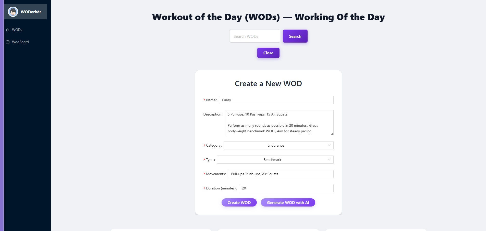
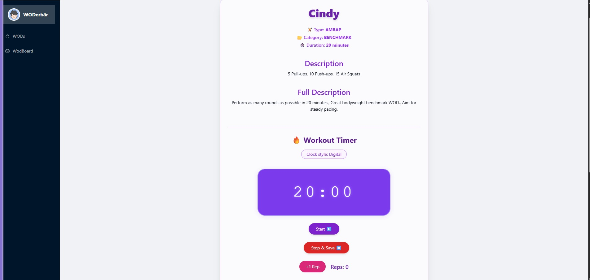
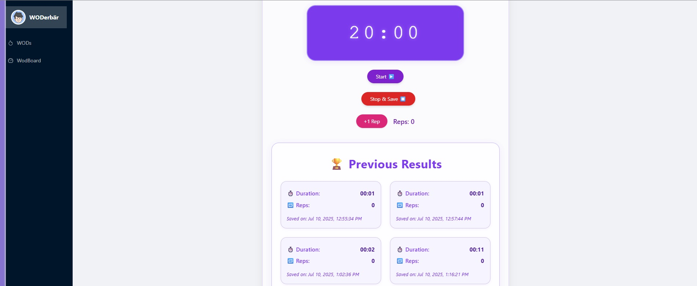
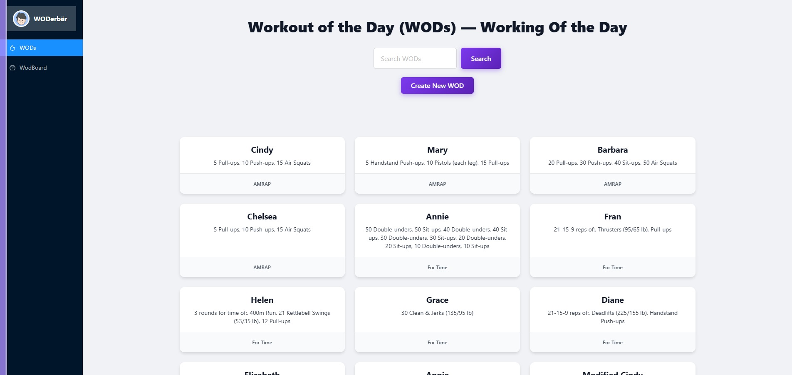
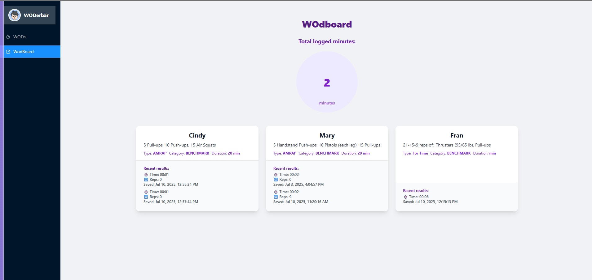
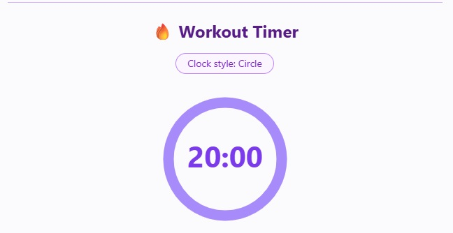

# Fitness Project – README

## English

### Tech Stack

- **Frontend:** Angular 18, Ng-Zorro, Chart.js, Tailwind CSS
- **Backend:** Spring Boot (Java 17+), Spring Security, PostgreSQL
- **AI Service:** Python (Flask), HuggingFace Transformers (T5 model)
- **Communication:** REST API (JSON)
- **Other:** Docker (optional for DB), virtualenv (Python)

### Requirements

- Node.js (v18+ recommended)
- npm (v9+)
- Angular CLI (`npm install -g @angular/cli`)
- Java 17+
- Maven
- Python 3.10+
- pip
- PostgreSQL (or Docker)
- Internet connection (for model download on first run)

🖼️ Project Screenshots / 🖼️ Projektscreenshots

Below are some screenshots illustrating the project: /
Unten finden Sie einige Screenshots, die das Projekt veranschaulichen:














### Local Setup – Step by Step

1. **Clone the repository**

   ```bash
   git clone <repo-url>
   cd Fitness
   ```

2. **AI Service (Python)**

   - Go to `ai-service`:
     ```bash
     cd ai-service
     ```
   - Create and activate virtualenv:
     ```bash
     python -m venv wod-env
     .\wod-env\Scripts\Activate.ps1   # Windows PowerShell
     ```
   - Install dependencies:
     ```bash
     pip install flask flask_cors transformers torch
     ```
   - Start the AI service:
     ```bash
     python app.py
     ```
   - The service runs on [http://127.0.0.1:5000](http://127.0.0.1:5000)

3. **Backend (Spring Boot)**

   - Go to `fitnessTrackerBackend`:
     ```bash
     cd ../fitnessTrackerBackend
     ```
   - Configure your PostgreSQL connection in `src/main/resources/application.properties`.
   - Start PostgreSQL locally or with Docker:
     ```bash
     docker run --name fitness-postgres -e POSTGRES_PASSWORD=yourpw -e POSTGRES_DB=fitness -p 5432:5432 -d postgres
     ```
   - Start the backend:
     ```bash
     .\mvnw.cmd spring-boot:run   # Windows
     # or
     mvn spring-boot:run
     ```
   - The backend runs on [http://localhost:8080](http://localhost:8080)

4. **Frontend (Angular)**

   - Go to `fitnessTrackerFrontend`:
     ```bash
     cd ../fitnessTrackerFrontend
     ```
   - Install dependencies:
     ```bash
     npm install
     ```
   - Start the frontend:
     ```bash
     ng serve
     ```
   - The app runs on [http://localhost:4200](http://localhost:4200)

5. **Usage**
   - Open the frontend in your browser.
   - For AI-generated WODs, both backend and AI service must be running.

---

## Deutsch

### Tech Stack

- **Frontend:** Angular 18, Ng-Zorro, Chart.js, Tailwind CSS
- **Backend:** Spring Boot (Java 17+), Spring Security, PostgreSQL
- **AI-Service:** Python (Flask), HuggingFace Transformers (T5 Modell)
- **Kommunikation:** REST API (JSON)
- **Sonstiges:** Docker (optional für DB), virtualenv (Python)

### Voraussetzungen

- Node.js (empfohlen v18+)
- npm (v9+)
- Angular CLI (`npm install -g @angular/cli`)
- Java 17+
- Maven
- Python 3.10+
- pip
- PostgreSQL (oder Docker)
- Internetverbindung (für Modelldownload beim ersten Start)

### Lokale Einrichtung – Schritt für Schritt

1. **Repository klonen**

   ```bash
   git clone <repo-url>
   cd Fitness
   ```

2. **AI-Service (Python)**

   - Wechsle in das Verzeichnis `ai-service`:
     ```bash
     cd ai-service
     ```
   - Erstelle und aktiviere ein virtuelles Environment:
     ```bash
     python -m venv wod-env
     .\wod-env\Scripts\Activate.ps1   # Windows PowerShell
     ```
   - Installiere die Abhängigkeiten:
     ```bash
     pip install flask flask_cors transformers torch
     ```
   - Starte den AI-Service:
     ```bash
     python app.py
     ```
   - Der Service läuft auf [http://127.0.0.1:5000](http://127.0.0.1:5000)

3. **Backend (Spring Boot)**

   - Wechsle in das Verzeichnis `fitnessTrackerBackend`:
     ```bash
     cd ../fitnessTrackerBackend
     ```
   - Konfiguriere deine PostgreSQL-Verbindung in `src/main/resources/application.properties`.
   - Starte PostgreSQL lokal oder mit Docker:
     ```bash
     docker run --name fitness-postgres -e POSTGRES_PASSWORD=deinpasswort -e POSTGRES_DB=fitness -p 5432:5432 -d postgres
     ```
   - Starte das Backend:
     ```bash
     .\mvnw.cmd spring-boot:run   # Windows
     # oder
     mvn spring-boot:run
     ```
   - Das Backend läuft auf [http://localhost:8080](http://localhost:8080)

4. **Frontend (Angular)**

   - Wechsle in das Verzeichnis `fitnessTrackerFrontend`:
     ```bash
     cd ../fitnessTrackerFrontend
     ```
   - Installiere die Abhängigkeiten:
     ```bash
     npm install
     ```
   - Starte das Frontend:
     ```bash
     ng serve
     ```
   - Die App läuft auf [http://localhost:4200](http://localhost:4200)

5. **Benutzung**
   - Öffne das Frontend im Browser.
   - Für AI-generierte WODs müssen Backend und AI-Service laufen.

---
