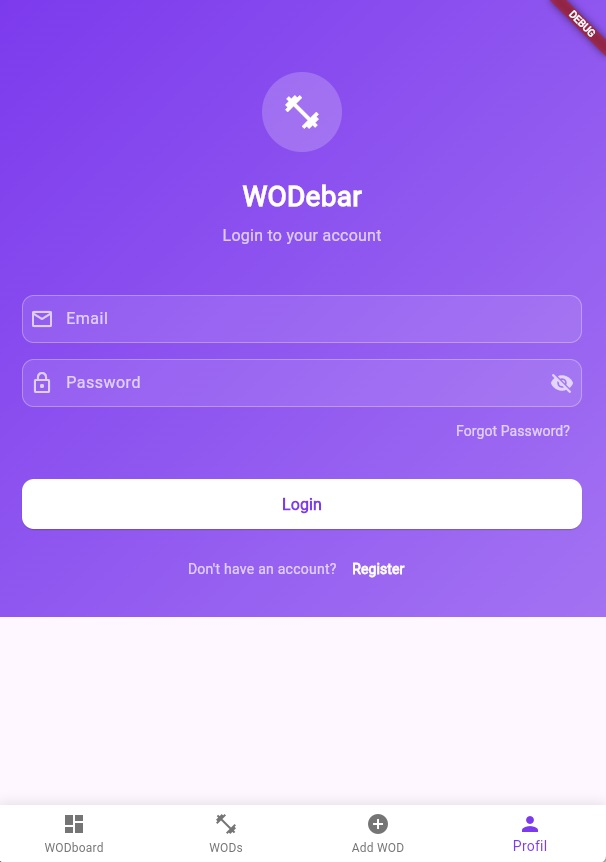
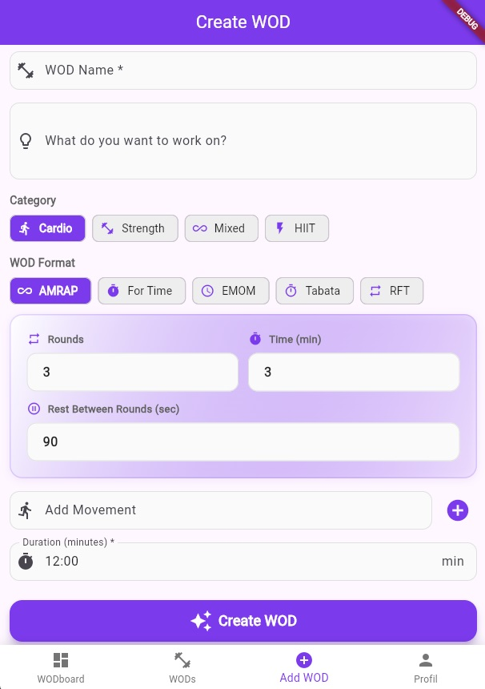
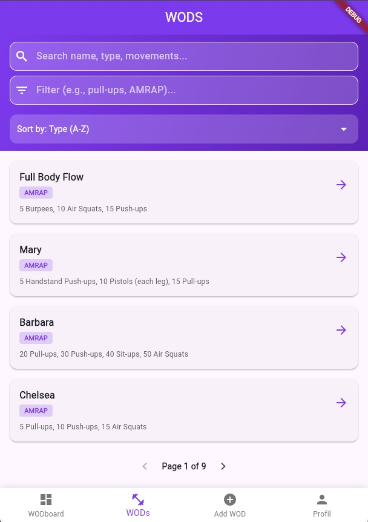
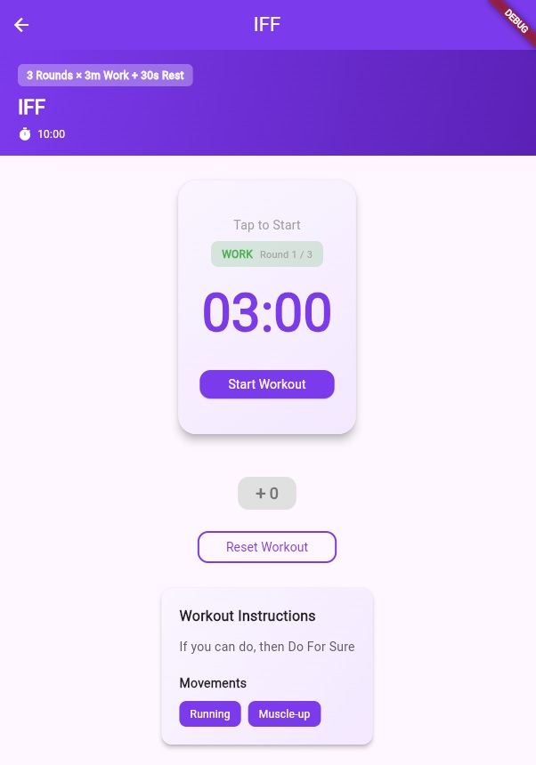
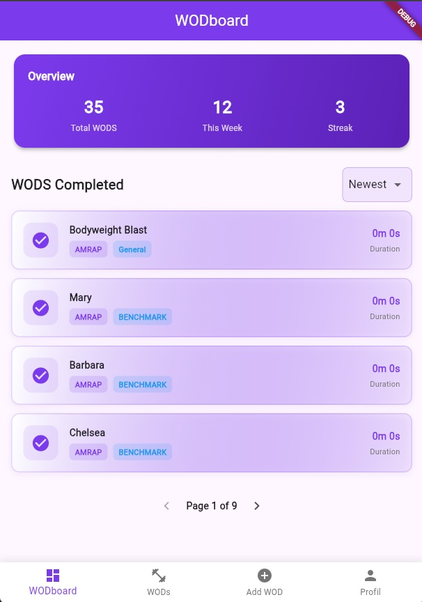

# Fitness Project – README

## English

### Tech Stack

- **Frontend:** Angular 18, Ng-Zorro, Chart.js, Tailwind CSS
- **Backend:** Spring Boot (Java 17+), Spring Security, PostgreSQL
- **AI Integration:** OpenAPI (GPT-4)
- **Communication:** REST API (JSON)
- **Other:** Docker (optional for DB)

### Requirements

- Node.js (v18+ recommended)
- npm (v9+)
- Angular CLI (`npm install -g @angular/cli`)
- Java 17+
- Maven
- PostgreSQL (or Docker)
- OpenAPI API Key (for AI-generated WODs)

🖼️ Project Screenshots / 🖼️ Projektscreenshots

Below are some screenshots illustrating the project: /
Unten finden Sie einige Screenshots, die das Projekt veranschaulichen:


Mobile:











## 📱 Flutter Mobile App

The Fitness Tracker mobile app is built with **Flutter**, providing a native cross-platform experience for iOS, Android, Web, and Desktop.

### Features

- **Dashboard** - Overview of completed workouts, statistics, and recent activity
- **WOD List** - Browse all available workouts with search and filter functionality
- **WOD Generator** - Create custom workouts with different formats (AMRAP, For Time, EMOM, Tabata, RFT)
- **Timer & Workout Tracking** - Real-time workout execution with:
  - Automatic countdown (3-2-1 GO!)
  - Phase-based timing for AMRAP/RFT workouts
  - Work/Rest cycle tracking
  - Rep counter for AMRAP and RFT formats
  - Automatic save of workout results
- **Profile** - User profile management and preferences

### Flutter Tech Stack

- **Framework:** Flutter 3.x
- **State Management:** Provider
- **HTTP Client:** Dart http package
- **UI Components:** Material Design
- **Local Storage:** Shared Preferences

### Setup - Flutter Mobile

1. **Install Flutter**
   - Download from [flutter.dev](https://flutter.dev)
   - Follow installation guide for your OS

2. **Navigate to the project**

   ```bash
   cd fitness_mobile
   ```

3. **Get dependencies**

   ```bash
   flutter pub get
   ```

4. **Run on your device/emulator**

   ```bash
   # For Android
   flutter run -d android

   # For iOS
   flutter run -d ios

   # For Chrome/Web
   flutter run -d chrome
   ```

### Flutter Screenshots

> 🖼️ Screenshots from all screens will be added here

- **Dashboard** - Workout history and statistics
- **WODS** - Browse and filter WODs
- **Create WOD** - AI-powered and manual WOD creation
- **Timer Screen** - Real-time workout tracking with visual feedback
- **Workout Detail** - Full workout specifications and movements

---

1. **Clone the repository**

   ```bash
   git clone <repo-url>
   cd Fitness
   ```

2. **Backend (Spring Boot)**
   - Go to `fitnessTrackerBackend`:
     ```bash
     cd fitnessTrackerBackend
     ```
   - Configure your PostgreSQL connection in `src/main/resources/application.properties`.
   - Add your OpenAPI API key to the application properties or environment variables.
   - Start PostgreSQL locally or with Docker:
     ```bash
     docker run --name fitness-postgres -e POSTGRES_PASSWORD=yourpw -e POSTGRES_DB=fitness -p 5432:5432 -d postgres
     ```
   - Start the backend:
     ```bash
     .\mvnw.cmd spring-boot:run   # Windows
     # or
     mvn spring-boot:run
     ```
   - The backend runs on [http://localhost:8080](http://localhost:8080)

3. **Frontend (Angular)**
   - Go to `fitnessTrackerFrontend`:
     ```bash
     cd fitnessTrackerFrontend
     ```
   - Install dependencies:
     ```bash
     npm install
     ```
   - Start the frontend:
     ```bash
     ng serve
     ```
   - The app runs on [http://localhost:4200](http://localhost:4200)

4. **Usage**
   - Open the frontend in your browser.
   - AI-generated WODs are powered by OpenAPI integration in the backend.

---

## Deutsch

### Tech Stack

- **Frontend:** Angular 18, Ng-Zorro, Chart.js, Tailwind CSS
- **Backend:** Spring Boot (Java 17+), Spring Security, PostgreSQL
- **KI-Integration:** OpenAPI (GPT-4)
- **Kommunikation:** REST API (JSON)
- **Sonstiges:** Docker (optional für DB)

### Voraussetzungen

- Node.js (empfohlen v18+)
- npm (v9+)
- Angular CLI (`npm install -g @angular/cli`)
- Java 17+
- Maven
- PostgreSQL (oder Docker)
- OpenAPI API Key (für KI-generierte WODs)

### Lokale Einrichtung – Schritt für Schritt

1. **Repository klonen**

   ```bash
   git clone <repo-url>
   cd Fitness
   ```

2. **Backend (Spring Boot)**
   - Wechsle in das Verzeichnis `fitnessTrackerBackend`:
     ```bash
     cd fitnessTrackerBackend
     ```
   - Konfiguriere deine PostgreSQL-Verbindung in `src/main/resources/application.properties`.
   - Füge deinen OpenAPI API Key zu den Application Properties oder Umgebungsvariablen hinzu.
   - Starte PostgreSQL lokal oder mit Docker:
     ```bash
     docker run --name fitness-postgres -e POSTGRES_PASSWORD=deinpasswort -e POSTGRES_DB=fitness -p 5432:5432 -d postgres
     ```
   - Starte das Backend:
     ```bash
     .\mvnw.cmd spring-boot:run   # Windows
     # oder
     mvn spring-boot:run
     ```
   - Das Backend läuft auf [http://localhost:8080](http://localhost:8080)

3. **Frontend (Angular)**
   - Wechsle in das Verzeichnis `fitnessTrackerFrontend`:
     ```bash
     cd fitnessTrackerFrontend
     ```
   - Installiere die Abhängigkeiten:
     ```bash
     npm install
     ```
   - Starte das Frontend:
     ```bash
     ng serve
     ```
   - Die App läuft auf [http://localhost:4200](http://localhost:4200)

4. **Benutzung**
   - Öffne das Frontend im Browser.
   - KI-generierte WODs werden durch die OpenAPI-Integration im Backend bereitgestellt.

---
